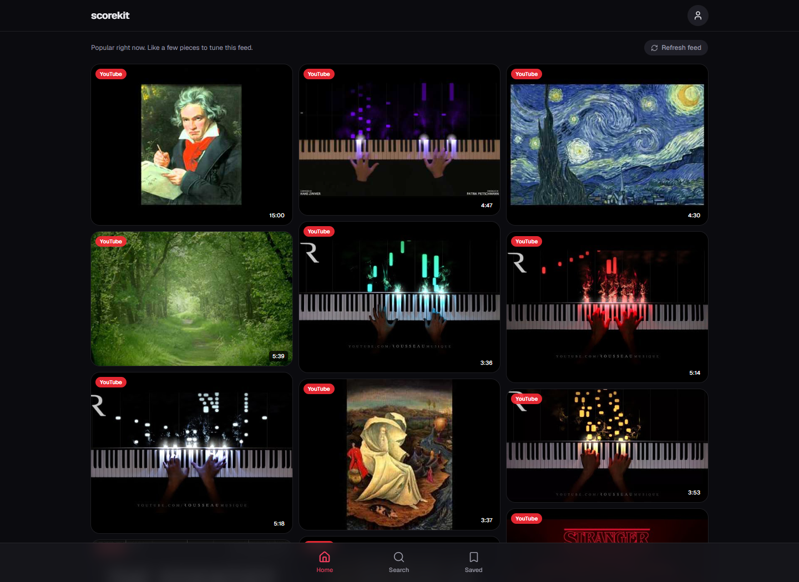
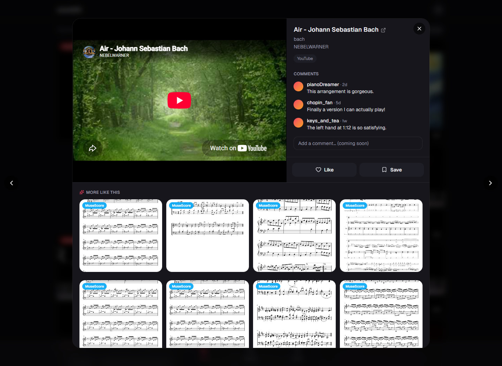

# scorekit

A visual discovery platform for piano music. Browse or search a board of cards, where
each card is a YouTube performance or tutorial, an IMSLP score, or a MuseScore listing,
and a like/save system learns your taste to personalise a home feed.



Opening a card shows the piece alongside sheet music for it, recommended using that card
rather than against your overall taste, so it works on the first click:



## The problem

Piano learners face a two-part gap that no single tool covers:

1. **What to play next** is unguided. There is no taste-based discovery by era, mood,
   difficulty or composer the way Spotify and Pinterest do it for their domains.
2. **Finding the sheet music** is fragmented across YouTube, IMSLP and MuseScore, with
   nothing connecting the three.

## Two feed modes

- **Search** queries a specific piece and returns a mixed board from all three sources.
  Pieces not yet in the database are ingested on demand and streamed in as they arrive.
- **Home** has no query. It ranks the database against what you have liked and saved.

## Status

All three source connectors are live. The database holds roughly 580 pieces seeded from
IMSLP's catalogue, each carrying derived tags (composer, era, form, instrumentation). The
feed UI is built, including live search, interaction logging and a content-based
recommender.

A learned ranker is wired in alongside it. In evaluation a random forest beats the
hand-tuned baseline by 0.050 AUC, with precision@10 of 1.00 against 0.30. A promotion gate
governs whether it actually serves: The new model has to clear a fixed margin on held-out data
before it replaces the baseline, and on a real interaction log there are not yet enough
likes to measure that, so the hand-tuned ranker runs the feed until there are.

## Architecture

- **Backend:** Python 3.13. Ingestion jobs per source, with a FastAPI service the
  frontend calls for search, recommendations and interaction logging.
- **Storage:** Supabase (managed Postgres).
- **Frontend:** Next.js (App Router) with a masonry board.
- **Containerisation:** Docker.

### Pipeline

```
query
  -> each connector searches its source
  -> results normalised into Card objects
  -> YouTube results filtered to piano only
  -> attribution filter drops cards that are not the queried piece
  -> IMSLP enrichment (licence, instrumentation, style)
  -> upsert piece and cards into Supabase
  -> tags derived for the piece
  -> feed renders, interactions logged, recommender ranks Home
```

### Data model

| Table | Purpose |
|---|---|
| `pieces` | One row per real piece. Created the first time it is searched or seeded. |
| `cards` | One row per individual result (a video, a score, a listing), linked to a piece. This is what renders. |
| `piece_tags` | Derived features (composer, era, form, format, instrumentation) that the recommender ranks over. |
| `interactions` | Append-only log of impressions, opens, likes and saves. The recommender's training signal. |

Cards from different sources are never merged into one grouped result. Each stays its own
card; normalisation happens behind the scenes through a shared `piece_id` so preference
signal can be attributed across sources.

## Recommendation

Home is ranked by tag affinity. A profile is built from what you have liked and saved,
weighted by signal strength and by how rare each tag is in the corpus, then every card is
scored against it and a diversity pass stops one composer filling the board. This ranker is
hand-tuned and it is what serves the feed today.

A learned ranker sits beside it. Four models are fitted and compared against the hand-tuned
one on identical rows: logistic regression, random forest, a random forest whose
hyperparameters are cross-validated, and XGBoost. Features are crossed with the user's
history rather than per composer, so 35 sparse columns become one dense one that
works from the first like.

**Evaluation** uses two splits. *Chronological* trains on each user's past to predict their
future, which is the production question. *Cross-user* holds out whole people, asking
whether it works for someone never seen. For every row the taste profile is rebuilt from
only earlier events, or the profile would already contain the like being predicted.

Currently measured on sixteen simulated users, since a ranker cannot be judged before it has traffic.
Their preferences are written down as numbers the model never sees; it only sees the
behaviour those numbers produced. Twelve have tastes that are a weighted sum over tags;
four also have interaction effects, which no weighted sum can express and which are the
reason to reach for a tree at all.

| model | AUC (95% interval) | precision@10 |
|---|---|---|
| random forest | **0.857** (0.810 to 0.900) | 1.00 |
| random forest, tuned | 0.851 (0.805 to 0.891) | 1.00 |
| xgboost | 0.849 (0.802 to 0.893) | 0.90 |
| logistic regression | 0.825 (0.775 to 0.873) | 1.00 |
| hand-tuned baseline | 0.807 | 0.30 |

AUC is the probability a liked piece scores above an unliked one, bootstrapped over 1,230
held-out rows. The top three are statistically tied; the forest is separated from the
baseline, and from logistic regression, which is the interesting part. Both the baseline
and logistic regression are weighted sums, so neither can express a taste that depends on a
*pair* of tags. Precision@10 is the sharper split: the baseline is 0.05 behind on AUC but
gets 3 of its top 10 right against the forest's 10.

**A promotion gate** decides what model is used. A model needs 40 positives, a score better than
chance (0.5), and a 0.03 AUC margin over the baseline. Below that the hand-tuned ranker keeps the
feed. The threshold was set before any results existed and has not been moved. Nothing has
passed on real logged data, which holds far too few likes to measure anything.

Full method, the two evaluations that disagree, and the results that turned out to be
wrong: see [PROJECT_CONTEXT.md](PROJECT_CONTEXT.md).

## Setup

```bash
python -m venv .venv && .venv/Scripts/activate     # Windows
pip install -r requirements.txt
cp .env.example .env                                # then fill in the keys
```

Frontend environment goes in `web/.env.local` (`SUPABASE_URL`, `SUPABASE_SERVICE_KEY`).

```bash
npm install          # root, for the dev launcher
npm run dev          # starts the API on :8000 and the web app on :3210
```

## Common commands

```bash
python -m scorekit.jobs.ingest --query "Clair de Lune"   # ingest one piece
python -m scorekit.jobs.seed --per-composer 15           # seed from IMSLP's catalogue
python -m scorekit.jobs.tag_pieces                       # rebuild piece_tags
python -m scorekit.jobs.stats                            # summarise the interaction log
python -m scorekit.jobs.train_model                      # train and evaluate the ranker
python -m scorekit.jobs.train_model --promote            # serve it if it clears the gate
python -m scorekit.jobs.train_model --force              # save a failing fit for testing
python -m scorekit.jobs.compare                          # heuristic vs model, side by side
python -m scorekit.jobs.simulate                         # synthetic users with a known taste
python -m scorekit.jobs.recover                          # did the model recover that taste?
python -m scorekit.jobs.migrate                          # apply db/migrations
pytest                                                    # run the test suite
```

## Sources

| Source | Access | Notes |
|---|---|---|
| YouTube | YouTube Data API | Structured and legal. Quota-limited to about 100 searches a day. Results are filtered to piano only. |
| IMSLP | MediaWiki API | Public-domain scores with rich metadata. No quota, so the corpus is seeded from here. |
| MuseScore | Tavily search restricted to musescore.com | Sidesteps blocked scraping and the discontinued MuseScore and Google Custom Search APIs. |

## Build phases

| Phase | Scope | State |
|---|---|---|
| 0 | Repo, Supabase schema, Docker skeleton | Done |
| 1 | YouTube connector | Done |
| 2 | IMSLP connector, enrichment, disambiguation | Done |
| 3 | MuseScore via Tavily | Done |
| 4 | Feed UI, live search, corpus seeding | Done |
| 5 | Interaction logging | Done |
| 6 | Recommendation engine | Content-based live; learned ranker gated on data volume |
| 7 | Polish and deploy | Not started |

See `PROJECT_CONTEXT.md` for design decisions and the reasoning behind them.
